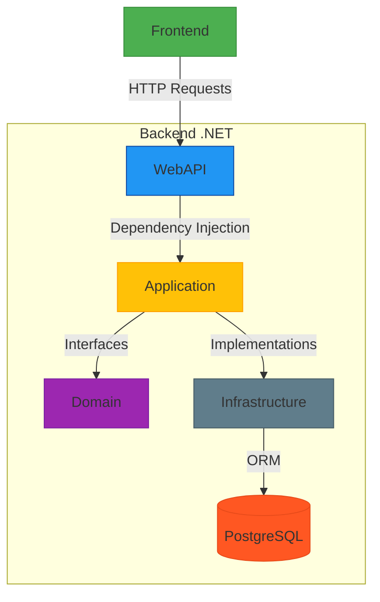

# GroceryBackend - .NET REST API with PostgreSQL

A scalable backend API for grocery management, built with .NET 8, Clean Architecture, JWT authentication, and Docker.

## Table of Contents
- [Requirements](#requirements)
- [Setup](#setup)
- [Docker Deployment](#docker-deployment)
- [Project Structure](#project-structure)
- [Backend Diagram](#db-migration)
- [API Endpoints](#api-endpoints)
- [JWT Authentication](#jwt-authentication)
- [Database Scripts](#db-migration)


## Requirements
- .NET 8 SDK
- Docker 20.10+
- PostgreSQL 15+

## Setup
1. Clone the repository:

```bash
   git clone https://github.com/giovannymontero99/grocery-backend.git
```

# Docker Deployment

2. Build and run containers

```bash
   docker-compose up -d --build
```


# Project Structure


* src/
	* Application/      # Business logic layer (services, DTOs, interfaces, use cases).
	* Domain/           # Pure business logic (domain rules, abstractions).
	* Infrastructure/   # Infrastructure/persistence layer (EF Core, databases, external services).
	* WebAPI/           # Presentation layer (controllers, HTTP, DI configuration).

* Clean Architecture Flow:
	* Request -> Controller -> Service -> Repository -> EF Core -> PostgreSQL.


# Backend Diagram




#  API Endpoints

**Authentication**

* POST /api/auth/login - JWT login
* POST /api/auth/signup  - User registration

**Products**

* GET /api/v1/profile/ - Information about user logged
* GET api/v1/profile/products  - Obtain all the products
* GET api/v1/profile/add_favorite_product  - Add a favorite product to personal list
* GET api/v1/profile/favorite_products  - Obtain all favorite product 
* POST api/v1/profile/delete_favorite_product  - Delete a product from favorite list
* POST api/v1/profile/save_favorite_product  - Update the state save from a list of favorite products


### Login Request
```json
{
	"Name": "DEMO",
	"Password": "DEMO"
}
```

### Register Request
```json
{
	"FullName": "GIOVANNY ANDRES MONTERO",
	"Email": "DEMO@DEMO.COM",
	"Name": "DEMO",
	"Password": "DEMO"
}
```

# Database Scripts

```sql

-- Add data to products table

INSERT INTO products
(product_product, product_name, product_description, product_price, product_category, product_created_at, product_updated_at, product_is_active)
VALUES(1, 'Wireless Mouse', 'Ergonomic wireless mouse with adjustable DPI.', 25.99, 'Electronics', '2025-07-25 12:29:53.739', '2025-07-25 12:29:53.739', true);
INSERT INTO products
(product_product, product_name, product_description, product_price, product_category, product_created_at, product_updated_at, product_is_active)
VALUES(2, 'Yoga Mat', 'Non-slip yoga mat, ideal for all types of workouts.', 19.50, 'Fitness', '2025-07-25 12:29:53.739', '2025-07-25 12:29:53.739', true);
INSERT INTO products
(product_product, product_name, product_description, product_price, product_category, product_created_at, product_updated_at, product_is_active)
VALUES(3, 'Coffee Maker', 'Programmable coffee maker with 12-cup capacity.', 79.99, 'Home Appliances', '2025-07-25 12:29:53.739', '2025-07-25 12:29:53.739', true);
INSERT INTO products
(product_product, product_name, product_description, product_price, product_category, product_created_at, product_updated_at, product_is_active)
VALUES(4, 'Bluetooth Headphones', 'Over-ear Bluetooth headphones with noise cancellation.', 59.95, 'Electronics', '2025-07-25 12:29:53.739', '2025-07-25 12:29:53.739', true);
INSERT INTO products
(product_product, product_name, product_description, product_price, product_category, product_created_at, product_updated_at, product_is_active)
VALUES(5, 'Running Shoes', 'Lightweight running shoes for all terrains.', 89.00, 'Footwear', '2025-07-25 12:29:53.739', '2025-07-25 12:29:53.739', true);
INSERT INTO products
(product_product, product_name, product_description, product_price, product_category, product_created_at, product_updated_at, product_is_active)
VALUES(6, 'Desk Lamp', 'LED desk lamp with adjustable brightness and USB port.', 34.20, 'Home & Office', '2025-07-25 12:29:53.739', '2025-07-25 12:29:53.739', true);
INSERT INTO products
(product_product, product_name, product_description, product_price, product_category, product_created_at, product_updated_at, product_is_active)
VALUES(7, 'Water Bottle', 'Insulated stainless steel bottle, 1 liter.', 15.75, 'Fitness', '2025-07-25 12:29:53.739', '2025-07-25 12:29:53.739', true);
INSERT INTO products
(product_product, product_name, product_description, product_price, product_category, product_created_at, product_updated_at, product_is_active)
VALUES(8, 'Gaming Keyboard', 'Mechanical RGB gaming keyboard with macro keys.', 49.99, 'Electronics', '2025-07-25 12:29:53.739', '2025-07-25 12:29:53.739', true);
INSERT INTO products
(product_product, product_name, product_description, product_price, product_category, product_created_at, product_updated_at, product_is_active)
VALUES(9, 'Backpack', 'Water-resistant backpack with multiple compartments.', 39.80, 'Accessories', '2025-07-25 12:29:53.739', '2025-07-25 12:29:53.739', true);
INSERT INTO products
(product_product, product_name, product_description, product_price, product_category, product_created_at, product_updated_at, product_is_active)
VALUES(10, 'Cookware Set', '10-piece non-stick cookware set for everyday cooking.', 129.99, 'Kitchenware', '2025-07-25 12:29:53.739', '2025-07-25 12:29:53.739', true);
INSERT INTO products
(product_product, product_name, product_description, product_price, product_category, product_created_at, product_updated_at, product_is_active)
VALUES(11, 'Smartwatch', 'Fitness tracking smartwatch with heart rate monitor.', 129.99, 'Electronics', '2025-07-25 12:31:07.993', '2025-07-25 12:31:07.993', true);
INSERT INTO products
(product_product, product_name, product_description, product_price, product_category, product_created_at, product_updated_at, product_is_active)
VALUES(12, 'Electric Toothbrush', 'Rechargeable electric toothbrush with 3 modes.', 49.90, 'Personal Care', '2025-07-25 12:31:07.993', '2025-07-25 12:31:07.993', true);
INSERT INTO products
(product_product, product_name, product_description, product_price, product_category, product_created_at, product_updated_at, product_is_active)
VALUES(13, 'Portable Charger', '10000mAh power bank with dual USB output.', 22.50, 'Electronics', '2025-07-25 12:31:07.993', '2025-07-25 12:31:07.993', true);
INSERT INTO products
(product_product, product_name, product_description, product_price, product_category, product_created_at, product_updated_at, product_is_active)
VALUES(14, 'Scented Candles', 'Set of 4 aromatherapy candles with essential oils.', 18.75, 'Home Decor', '2025-07-25 12:31:07.993', '2025-07-25 12:31:07.993', true);

```